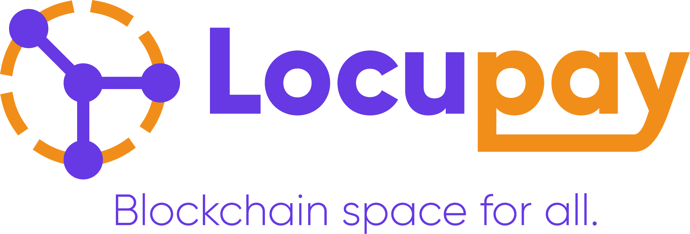

  

## Introduction

Locupay is a seamless and secure solution for individuals and SMEs to transact with crypto assets. It brings freedom and security to all users through unmatched encrypted matrix coding device cards used to authenticate transactions for individuals and structured libraries or widgets for SMEs.

## Challenges

Some individuals with crypto find it hard to exchange fiat assets because of trust in the conventional P2P structure of receiving fiat in a centralized system. This process and centralized systems can bring out several days of delay if fiat assets are seized or frauded before receiving hard cash from a machine. In a scenario someone is offline, access to crypto assets is blocked. Furthermore, individuals with zero knowledge of cryptocurrency or blockchain are excluded from the space to make transactions.

## What the app does

Locupay helps users (individuals, SMEs, and local agents) seamlessly transact crypto assets. It assists in transacting cryptocurrencies without the need for mobile phones. Users enjoy offline means of interacting on the blockchain with a fast and easy means to accepting crypto payments for vendors. It informs the awareness of financial freedom by promoting the benefits of a decentralized means of transaction with a local P2P exchange architecture.

## What next?

We want to start development with the multi-asset wallet that powers the web3 Defi application for users to utilize the features and services of Locupay across devices. We will then develop several libraries and widgets for SMEs to seamlessly accept crypto for payment with location services integration to help our local P2P exchange system alongside the invention of the encrypted QRcoded device cards.

## Who we are

Peter is a graduate of computer science skilled in programming abilities with solid blockchain interest. Emmanuel is a blockchain enthusiast with years of experience in building decentralized solutions.

   
  

